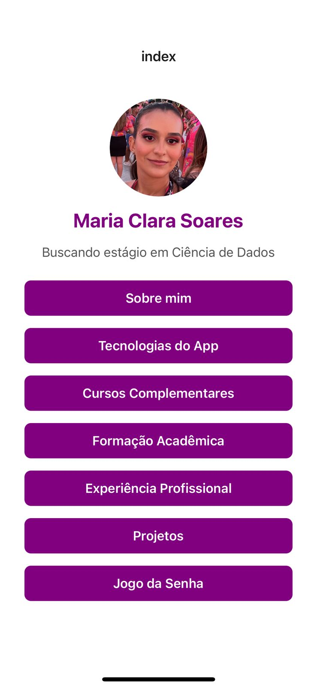
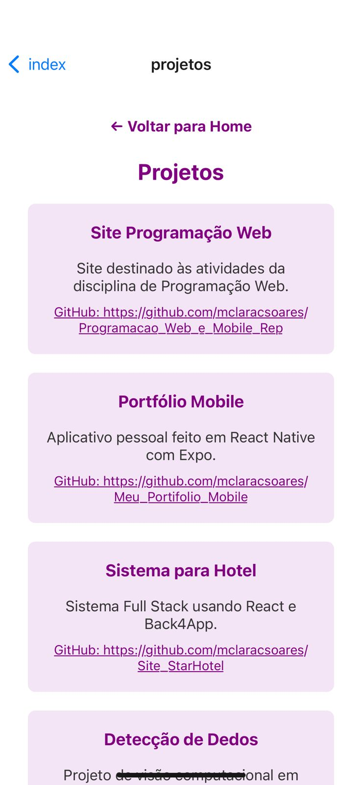
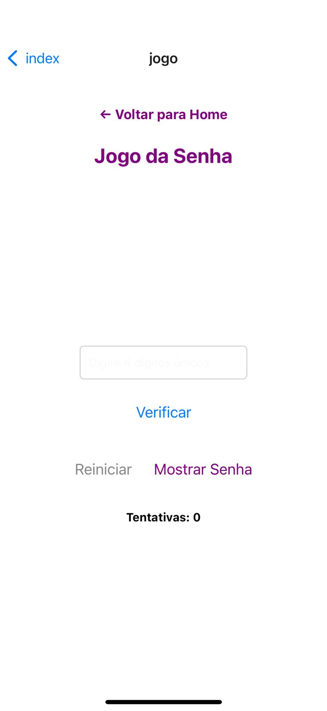
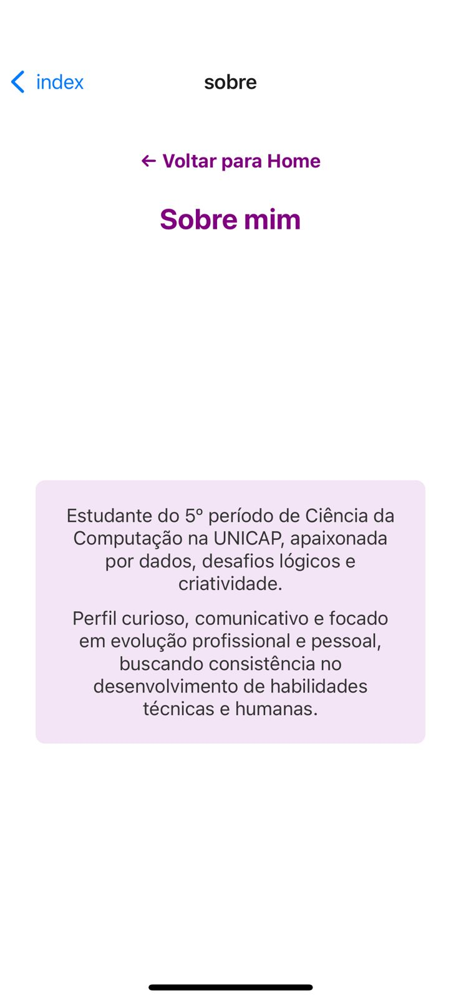
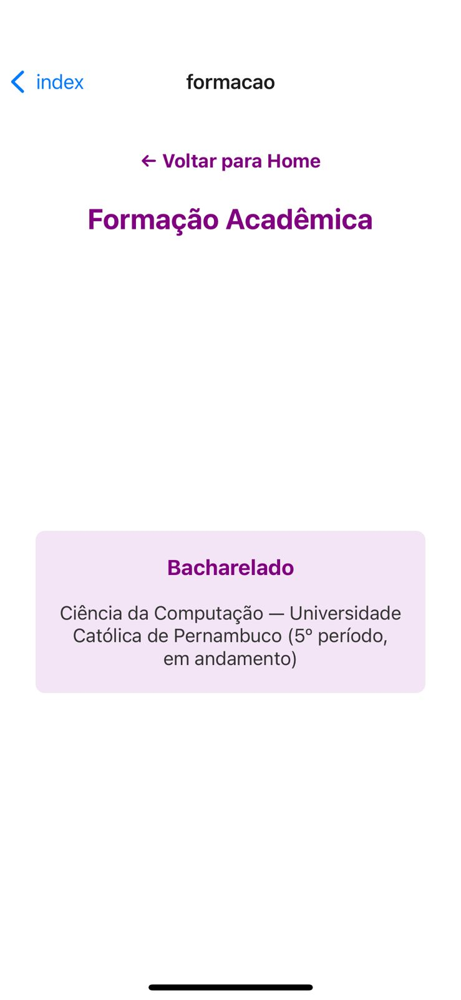
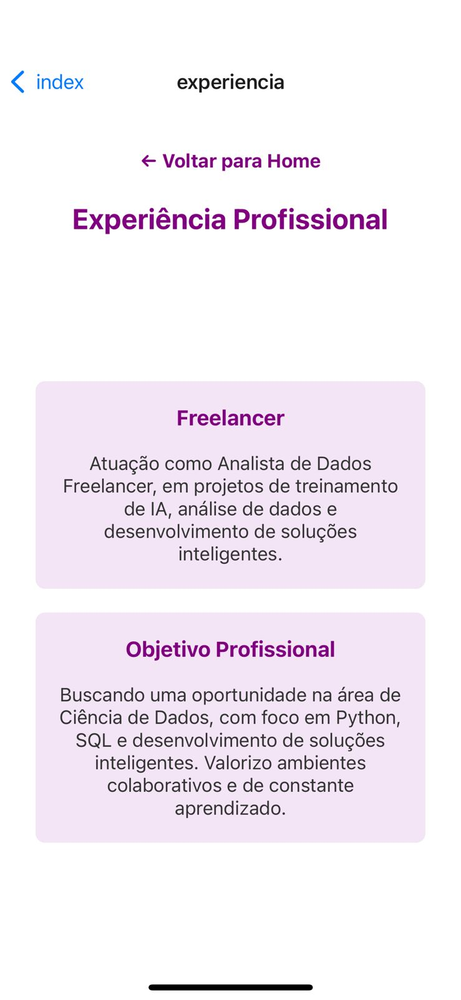
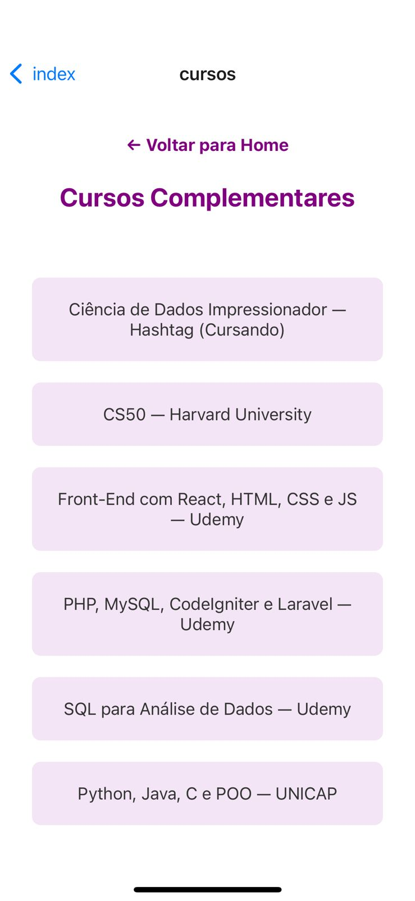
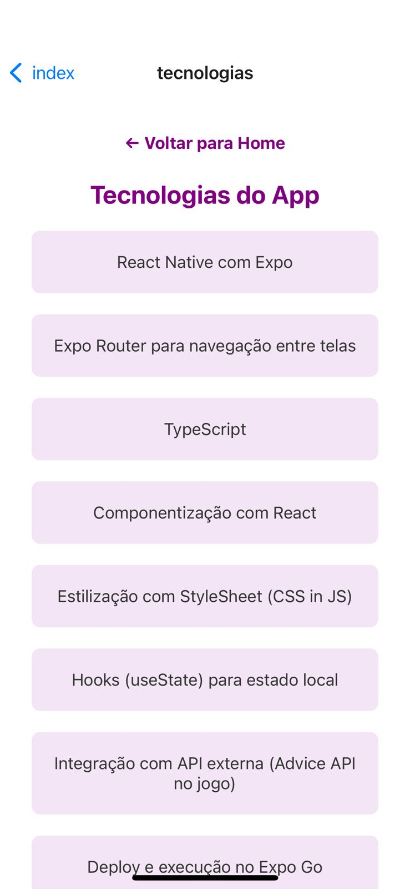
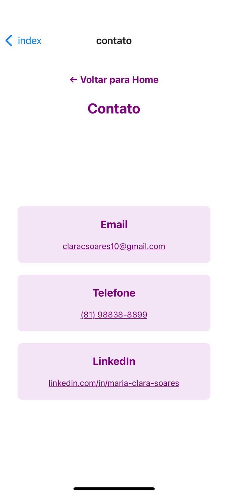

# 📱 Portfólio Mobile – Maria Clara Soares

Este é meu portfólio desenvolvido em **React Native com Expo**, onde apresento minha formação acadêmica, experiências, projetos, contatos e um mini game interativo (**Jogo da Senha – Bulls and Cows**). 

O objetivo deste app é demonstrar minhas habilidades tanto no desenvolvimento mobile quanto na organização de projetos, além de servir como vitrine profissional.

👩‍💻 Desenvolvido por

Maria Clara C Soares

## ✨ Funcionalidades

-  Tela inicial (Home) com navegação intuitiva
-  Sobre mim
-  Formação acadêmica
-  Cursos complementares
-  Experiência profissional
-  Portfólio com alguns projetos com links diretos para o GitHub
-  Contato com acesso rápido (email, telefone, LinkedIn)
-  Mini game: **Jogo da Senha (Bulls and Cows)**, com integração via API
-  Navegação entre páginas com **Expo Router**
-  Design responsivo e moderno, adaptado para mobile

## 🚀 Tecnologias Utilizadas

- **React Native com Expo**
- **Expo Router** – navegação entre telas
- **TypeScript**
- **Componentização com React**
- **Hooks (useState)**
- **StyleSheet (CSS-in-JS)**
- **Layout Responsivo com ScrollView, View e Flexbox**
- **SafeAreaView** – adaptação para telas de diferentes dispositivos
- **API externa** – Advice API no Jogo da Senha
- **Validações de dados** – bloqueio de números repetidos e tentativas duplicadas no jogo
- **Feedback ao usuário** – Alertas interativos e mensagens de sucesso ou erro
- **Navegação programática** – router.push e router.replace (Voltar para Home)
- **Links externos** – integração com e-mail, telefone, LinkedIn e GitHub
- **Uso de imagens locais** – carregamento de foto de perfil no app
- **Organização de código** – CSS separado em arquivo styles.ts e pastas por contexto
- **Deploy e execução no Expo Go**

## 🔗 Acesso

- ▶️ Veja o app rodando no Expo: [**Link para o Expo Go**](https://expo.dev/preview/update?message=Atualiza%C3%A7%C3%A3o%20com%20novas%20funcionalidades&updateRuntimeVersion=1.0.0&createdAt=2025-05-25T23%3A36%3A20.915Z&slug=exp&projectId=2564d7df-76d6-47e7-a7e5-e92f6c749168&group=33928cf2-073b-4e7e-af8b-46509b93ccba)
- 🧠 Repositório de código: [**GitHub**](https://github.com/mclaracsoares/Projeto_Portifolio_Mobile)

## 🖼️ Screenshots

|  |  |  |
|-----------------|---------------------|------------------|
| **Home**        | **Projetos**        | **Jogo da Senha**|

|  |  |  |
|-----------------|----------------------------|-------------------------------|
| **Sobre**       | **Formação Acadêmica**     | **Experiência Profissional**  |

|  |  |  |
|---------------------------|----------------------------|-----------------|
| **Cursos Complementares** | **Tecnologias Usadas**     | **Contato**     |

## 📚 Como executar

1. Clone o repositório:

```bash
git clone https://github.com/mclaracsoares/Portifolio_Mobile.git
```

Instale as dependências:
```bash
npm install
```

Rode o projeto:

```bash
npx expo start
```

Escaneie o QR Code com o app Expo Go no seu celular (Android ou iOS).

## 👩‍💻 Contato

📧 claracsoares10@gmail.com

🔗 linkedin.com/in/maria-clara-soares
